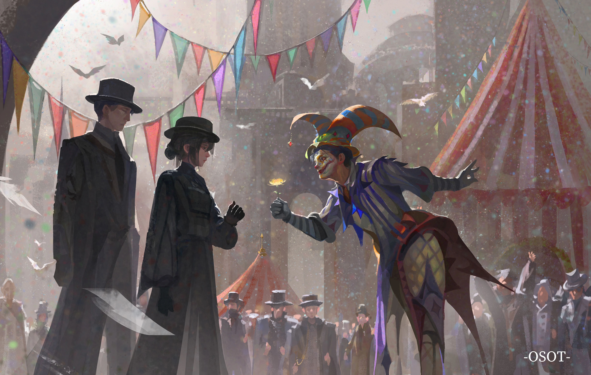
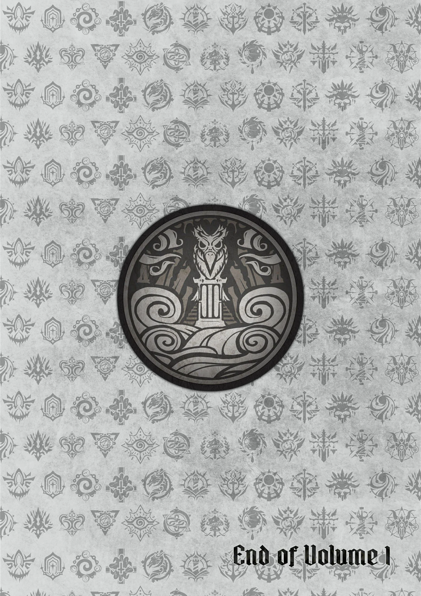
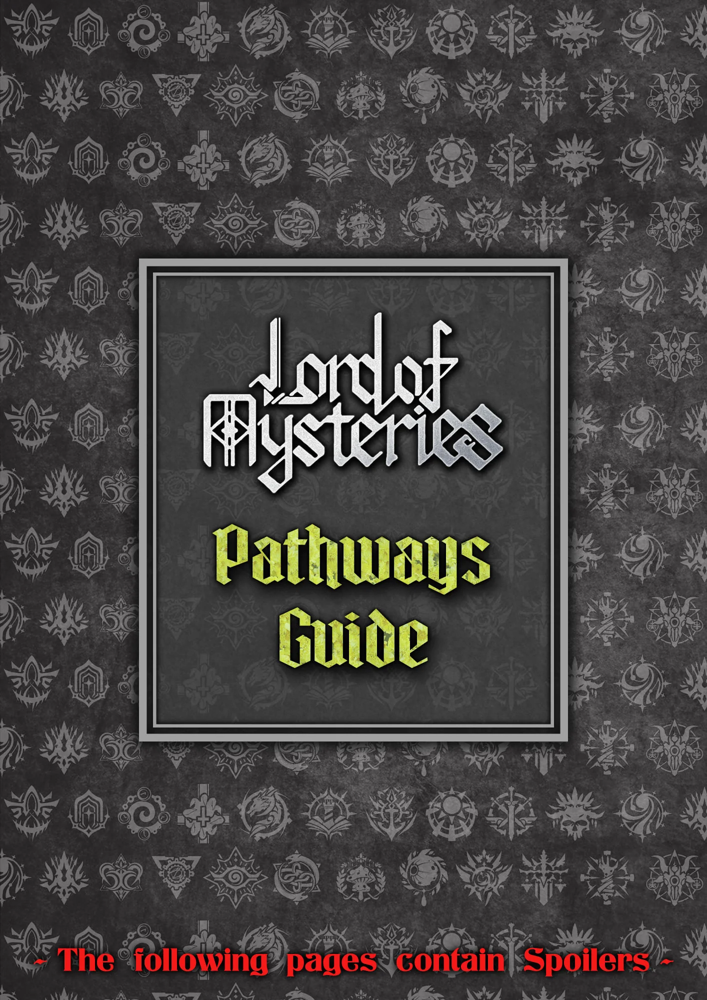
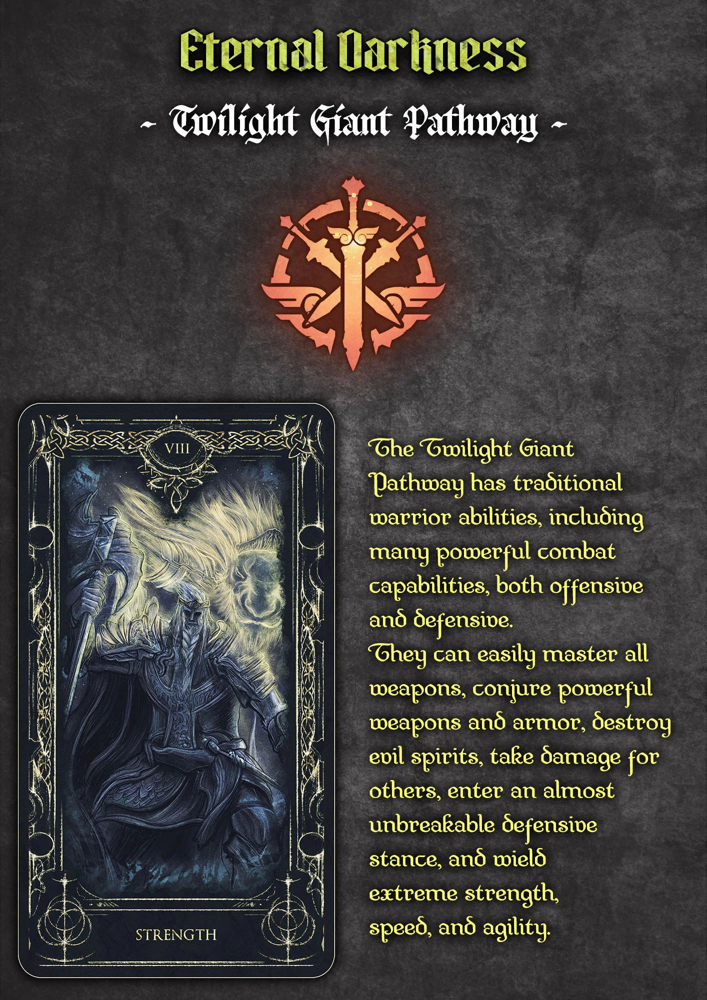
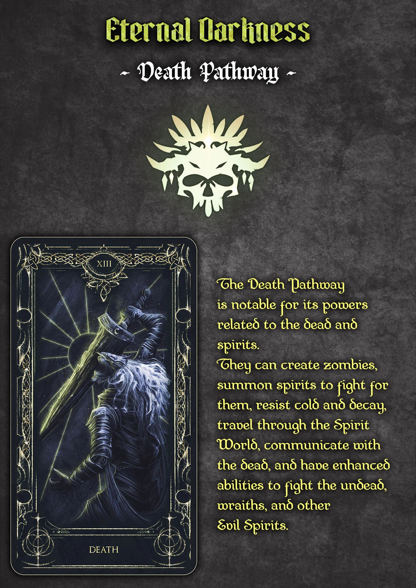
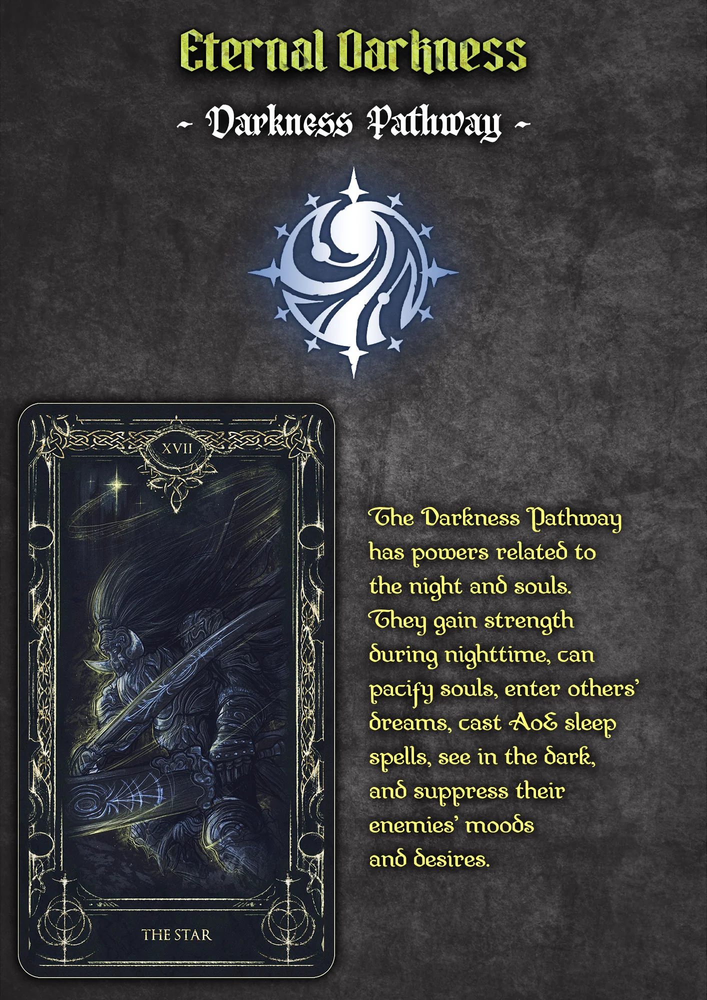
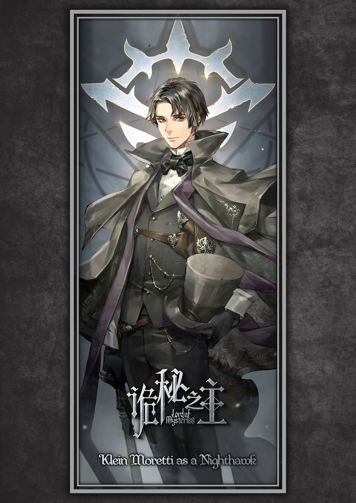
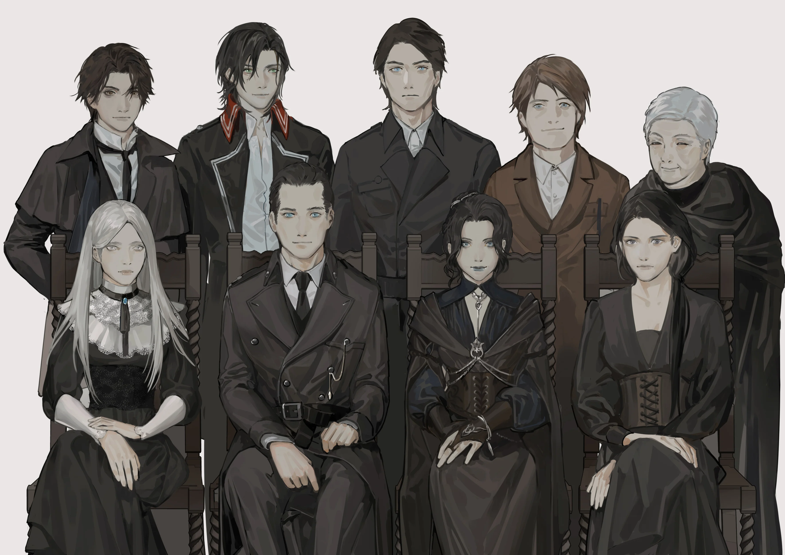
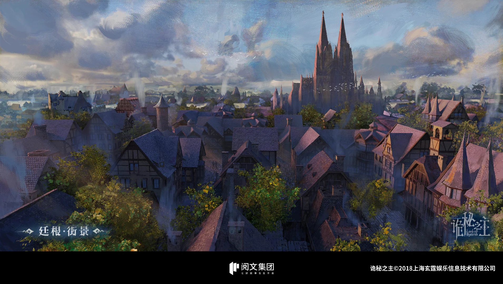
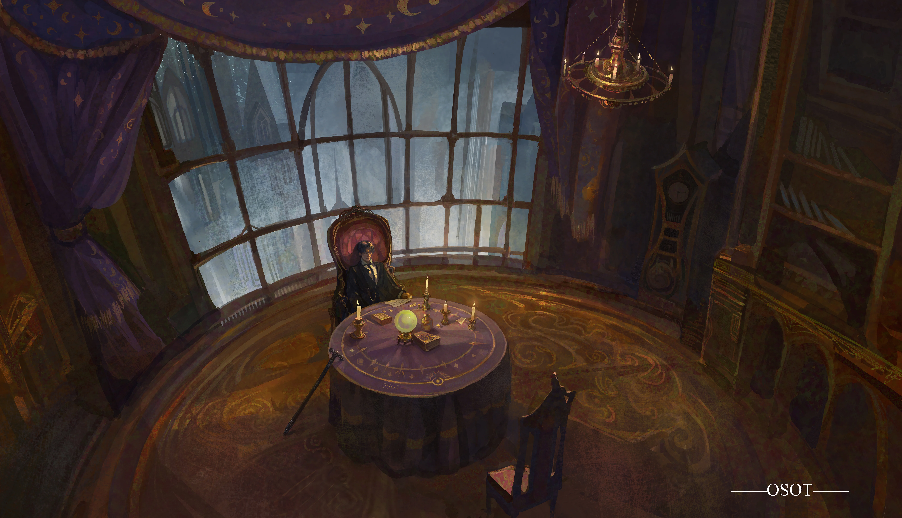

## Chapter 213: Another Look

*So Ince Zangwill has gone to Backlund... I wonder how long he'll stay
there... Yes... I should confirm this every now and then...*
Klein leaned forward as he thought. He erased the contents on the
goatskin and wrote a new divination statement:

"Lanevus's current location."

From his point of view, the person that caused the Captain and him to
nearly die was undoubtedly Ince Zangwill, but the lunatic Lanevus was
definitely an accomplice who cannot shirk from the responsibility. He
had to pay the price in blood!

After reciting the statement seven times, Klein once again entered the
dream. But the scene that appeared after the foggy world shattered was
the same as the one he had seen before!

*A wide, slightly murky river, countless piers and buildings. The
buildings were primarily in the present Loen architectural style, some a
little more Gothic. There were crowded streets, flourishing sights,
chimneys that continually spewed smoke. There were opulent castles
standing tall with the trademark Gothic clock towers...*

Lanevus was also in the "Land of Hope," the "Capital of Capitals,"
Backlund!

Klein opened his eyes, a little confused. He had divined for Lanevus's
specific location, but the results were still a very general, vague
region.

*This tells me that Lanevus's Sequence must be much higher than I
imagined... No, it could also be that he's received a large benefit from
helping the son of the True Creator descend upon this world. For
example, a little godhood characteristics, or some object similar to the
placenta left behind by Megose's baby? Hmm... The latter would most
likely have been taken away by Ince Zangwill.* Thoughts ran
through Klein's mind as he muttered to himself whilst he made initial
assumptions.

After confirming the rough area where both his enemies were, he thought
about another problem. He still didn't have the ability to exact
revenge!

*Even if Lanevus is only a Sequence 7, or even 8, it wouldn't be easy to
deal with him if he did indeed receive a large benefit. Lanevus is also
obviously very crafty, he could outwit and defeat Beyonders more
powerful than himself... Ince Zangwill is even more terrifying. He's a
Sequence 4 Demigod, and he wields a powerful Grade 0 Sealed Artifact...
Although there were some secrets surrounding my transmigration, it's
clear that I can't convert those secrets into combat strength. It's
likely that it's not possible for a very long period of time... The only
means that I have are to continue raising my Sequence, or I could
collect even more powerful mystical items. I have to use both the
methods at the same time...*

In between his thoughts, Klein decided to add another divination.

He deliberated on the statement before writing solemnly, "My
opportunities of becoming powerful."

He gently placed the pen on the table and leaned back, then he closed
his eyes.

He recited the statement silently and fell into a deep sleep with the
help of Cogitation.

In the foggy world, he once again saw the scene that he had previously
seen. The river, piers, chimneys, crowds, castles, various machinery,
and Gothic clock towers. He had once again seen the capital of the Loen
Kingdom, Backlund!

Immediately following that, the scene changed. He saw a magnificent peak
piercing through the clouds, and, on it, he saw a majestic, ancient
palace. He saw the giant throne carved from stone, adorned with dull
gems and gold. He saw a strange vertical pupil formed from countless
mysterious symbols.

The scene shattered silently without warning. Klein slowly sat up and
tapped on the edge of the table with his fingers.

*Backlund contains the opportunities for me to become
powerful...*

*Does the second scene refer to the main peak of the Hornacis mountain
range, the treasures left behind by the Antigonus family? The strange
vertical pupil formed by countless mysterious symbols which the
Misfortune Cloth Puppet conveyed to me through the corruption from the
Antigonus family's notebook is the key to beginning all of
this...*

Many thoughts flashed through his mind. Klein decided that he was in no
rush to visit the Hornacis mountain range. Even a Sequence 4 Demigod
might not be able to deal with the dangers that resided there.

*I guess I'll head to Backlund first...* Klein sighed and made a
decision. He enveloped himself with spirituality and stimulated a
descent, exiting the mysterious space above the gray fog.

When he returned to the material world, he slowly walked out of his
hiding spot towards Dunn Smith's grave.

He stared deeply at the picture and epitaph. Klein slowly drew a crimson
moon on his chest and walked out of the cemetery.

As a former Nighthawk, a Nighthawk who had to regularly patrol Raphael
Cemetery, he was quite familiar with the routes of the guards, as well
its surroundings. He managed to leave the cemetery easily, without
causing any alarm. He followed the gravel road into Tingen, using the
shade of the trees as cover.

The night was peaceful and the moon was ever-so dreamy. Klein walked
alone, his thoughts running wild and unbridled. He sometimes considered
his plan for revenge, sometimes thinking back to the times he spent with
the Captain, sometimes recalling Old Neil's hidden grief beneath his
humorous facade...

Unknowingly, Klein had entered the nearest street like a wandering
ghost, making his way past turn after turn.

It was two hours later when he freed himself from that state and
regained complete control of his thoughts.

He realized that he was standing on Daffodil Street. Opposite him was
the house he shared with his brother and sister.

Instinctively, Klein had returned here.

He took a step forward with clear joy, but suddenly paused. He let out a
bitter smile and muttered with a self-deprecating tone, "If I went up
and knocked on the door, Melissa might faint from shock... Benson would
be so nervous his hair would start to drop. He would then try his best
to calmly convince me, in the name of a curly-haired baboon..."

Shaking his head, Klein stared at the familiar door for a while before
heading towards Iron Cross Street.

*This is fine too, this is fine too... The things that I do in the
future will not implicate them. The compensation given to them by the
Nighthawks team and the police department will be enough for them to
live a stable middle-class life, even if Melissa fails to find a job and
Benson loses his job...*

Klein walked silently for a moment before starting to feel fatigue. But,
as someone who was "dead," he didn't have any other belongings on him
except for the clothes he was wearing, his topaz pendulum, and Azik's
copper whistle. He didn't have pounds, nor soli, nor pennies.

*Should I give the whistle a blow to send a letter to Mr. Azik and get
him to help me?* Klein laughed optimistically. *Forget it, I
shouldn't contact him for the time being. Perhaps Ince Zangwill is still
keeping him under surveillance. I'll look for him when the time is
right... To an old monster who has lived countless lives for thousands
of year, he should be able to understand resurrection... At least it's
not too cold tonight. I'll make do by finding a place to sleep for the
time being and head to the Tingen branch of the Backlund Bank tomorrow
morning to retrieve the money in the anonymous account.*

As there had been too many things to do lately. Klein hadn't had the
time to start on the experiments involving the sacrificial ritual. He
hadn't touched the 300 pounds in the anonymous account either.

*That should be enough to support my expenses for quite a while. I'll
buy a newspaper tomorrow to confirm what day it is... Miss Justice and
the others didn't make any new prayers, which means that I didn't miss a
gathering...* Klein thought as he found a spot that had no wind.
He sat down and took off his jacket. He used it as a blanket and leaned
on the wall to sleep.

It wasn't long into his sleep when he was suddenly woken by someone. He
saw a policeman wielding a baton.

He only had a single chevron on his epaulet, the lowest-ranking police
constable... Klein glanced at him to ascertain his identity.

The policeman said fiercely, "You can't sleep here!

"The streets and parks aren't for you lazy, jobless vagrants to sleep
in!

"Those are the terms in the Poor Law!"

*Is that so?* Klein froze. Given his sensitive identity, he
didn't argue with the policeman.

He grabbed his jacket and continued walking until daybreak.

Soon after, he lowered his head and entered the Tingen branch of the
Backlund Bank. He took out 200 pounds with the password he had set,
leaving behind a third of the money as "savings," in case of any
emergencies.

Without a doubt, Klein heard "prayers" when he wrote the password in
ancient Hermes.

Klein then spent 38 pounds on two sets of formal wear, two shirts, two
trousers, two pairs of leather boots, two bow ties, four pairs of socks,
as well as two thick double-breasted jackets, two solid colored fur
coats, and two pairs of thick trousers in preparation for the winter. He
also bought a cane, a wallet, and a leather luggage bag.

After completing his purchase, Klein found a hotel to wash up and change
in. He rented a private carriage directly to the train station in Tingen
in order to avoid meeting anyone familiar. Along the way, he purchased a
newspaper and discovered that it was Sunday.

It took about four hours to get from Tingen to Backlund by train. A
luxurious first-class seat cost about three-quarters of a pound, or 15
soli. A second-class seat cost 10 soli, or half a pound.

The packed, poorly-maintained third-class seats were rather cheap at
only 5 soli.

Klein thought for a moment before buying a seat for the two o'clock
train, a second-class seat.

Klein found a random spot to sit in the waiting area with his ticket and
luggage in hand. It was only slightly after nine in the morning.

He was happy that the Loen Kingdom didn't have a strict census. He could
prove his identity just by using the water and gas bills, as well as his
rent for the past three months. Purchasing a train ticket was even
easier, as all he needed was money.

Klein suddenly had an empty feeling in his heart as he was sitting
there, thinking about how he was about to leave for Backlund from Tingen
in the afternoon.

He thought about his sister who always gave him a motherly vibe. He
thought about his brother who liked to crack cold jokes. He thought
about how they would fill their stomachs up so much that they wouldn't
feel like moving...

Recalling these scenes, Klein suddenly laughed. He laughed bitterly, for
he thought about the tortoise that Melissa called a "puppet," as well as
Benson's pitiful hairline.

He suddenly had a strong urge. He wanted to see his siblings again.

At this moment, Klein suddenly realized why he hadn't picked an earlier
train but instead bought a ticket for the two o'clock train.

He carried his luggage and left the waiting area quickly, taking a
rented carriage back to Daffodil Street.

He then hid in a shady area on the opposite side and looked at the door
to his house. There were many times when he felt like heading over, but
he couldn't bring himself to cross the wide street.

Klein looked across the road in a daze, suddenly having a feeling of
homelessness. He'd had a similar feeling when he had just transmigrated.

Suddenly, he saw the door to the house open as Melissa and Benson came
out.

Melissa was wearing a black dress and black veiled hat. Benson was in a
shirt, vest, trousers, coat, and hat, all in black. They both had numb,
sullen expressions.

*Melissa has become skinnier... Why is Benson so haggard...*
Klein's heart winced in pain. He opened his mouth but couldn't shout out
their names.

Without realizing it, he followed Benson and Melissa to the nearest
municipal square. He saw that tents had been erected there again. A new
circus troupe was in town for a performance.

Benson took out some money and purchased the entrance tickets and led
Melissa into the circus. He forced a smile.

"This circus troupe is very famous."

Melissa nodded without expression.

"Okay."

Suddenly, she slipped and almost fell.

Klein, who was also buying a ticket, opened his mouth. He wanted to help
his sister, but he could only retract the hand he had instinctively
extended and stood helplessly in the busy crowd.

Benson jumped in fright, but he was too late to help. However, Melissa
quickly steadied herself. She puckered her lips and said nothing.

At this moment, clowns swarmed forward, some performing balancing acts
on wheels or large rubber balls, others tossing countless tennis balls
into the air, then ridiculously catching every one of them.

Melissa seemed to disregard the clowns as she looked at the performance.
Benson tried to lift his sister's spirits by cheering, but he didn't
succeed. He slowly turned sullen too.

Klein puckered his lips tightly as he watched this scene from afar. He
wanted to approach them, but he didn't dare to.

Suddenly, he touched the wallet in his jacket and had an idea.

Benson and Melissa continued walking forward, silently watching the
various performances.

Some time later, they saw a clown running towards them. His face was
painted in colorful pastels. At first, he threw a tennis ball into the
air, and, while the attention of the surrounding people was drawn to the
air, he conjured a flower out of thin air. It was a Seville
Chrysanthemum.

The clown brought the flower before Melissa and Benson. The flower was
golden in color and symbolized happiness.

Melissa and Benson looked at the clown in a daze. All they saw was a
wide smile plastered over the pastel face. It was a happy smile, an
exaggerated smile, a ridiculous smile.

___

Author's Notes:

First of all, I would like to thank all of you for your appreciation and
subscription. I should have made a speech at the end of June, but I
think the first one will be finished soon. I can write it together and
wait until today.

This man, in his thirties, his energy, especially his mind, has really
dropped a lot. At the time of the Throne of Magical Arcana, I wrote five
chapters and 15,000 chapters a day, just like beating chicken blood.
However, since the latter part of my life, I have written three chapters
a day at most. Besides sleeping and eating, I was thinking about the
plot and writing stories. As a result, I had abnormal mental states such
as anxiety and depression. I was also able to adjust to it in time. At
that time, I had old physical problems and stayed in the hospital for
half a month.

Therefore, we can only compromise with our physical and mental
conditions, one chapter in the morning, one chapter in the afternoon,
rest in the evening, keep healthy, and then leave two copies to keep the
update on time, avoid anxiety, and consider writing three chapters only
when we are in good condition and have a clear mind.

In June, I can honestly say that my dog's life is for the manuscript...
For a whole month, I didn't write three chapters for more than four
days, and the rest depended on saving my manuscript. At last, the saved
manuscript fell to the bottom line of two.

Well, I can only reluctantly say that let's win by the quality...

With the update, it is the summary of the first book. Basically, what
should be expressed has been expressed. The title of "Clown" runs
through the whole situation. Hehe, you can look back at the testimony. I
said that the various structures of this book are the most comprehensive
I have considered, and they echo each other before and after. We will
wait and see. Well, I think they are qualified.

The first one I've never tried before is written as a short story and
medium story, with the overall consideration of embedding thread and
layout design. Of course, the foreshadowing of the full text will
certainly remain. In short, judging from the current results, the
attempt is still successful, which is gratifying.

On the character, haha, I will not say more, or you'll be sent a
blade...

Of course, there is some dissatisfaction. First, when the "party",
"event", "practice" and "daily" began to show a fixed cycle, my feeling
of writing decreased, and I believe the reading feeling was the same.
Therefore, I tried to jump off the timeline, and after jumping, the
initial cut was relatively crude, but gradually improved. Second, after
the death of Old Neil, the overall tone showed the original gray, and
then I cut into daily life, I feel a bit wrong, so I deleted some of the
scheduled plots and speeded up the progress.

Secretly I set around six to eight books. The volume name of each book
will be the name of the sequence, but it is not necessarily Klein's
"Seer" pathway. It mainly depends on the theme or metaphor of the book.

Finally, the first part is finished. According to the usual practice, we
need to take a leave of absence and rest, sort out the outline, find the
second entry point, and work out the general plot. Well, rest for a day
and a half, and resume the update at noon the day after tomorrow. Also,
I will update some data of "0-08" on the Weixin Gongzhong later. It is
not related to the work, but I afraid that the new readers will see it,
and the first part will lose half of the fun. I will build a Sealed
Artifacts form in the book review area. If you have any idea about the
Sealed Artifacts, you can use it there. Maybe they will adopt, well, try
not to copy the SCP foundation.

By the way, the second book is the "Faceless", please look forward to it

Also, after self-praise and self-criticism, shouldn't everyone encourage
with the monthly ticket?

___

## Pathways Guide {epub:type=glossary .epub-invis}

## Image Gallery  {epub:type=glossary .epub-invis}

### Characters

### Artworks

### Locations

