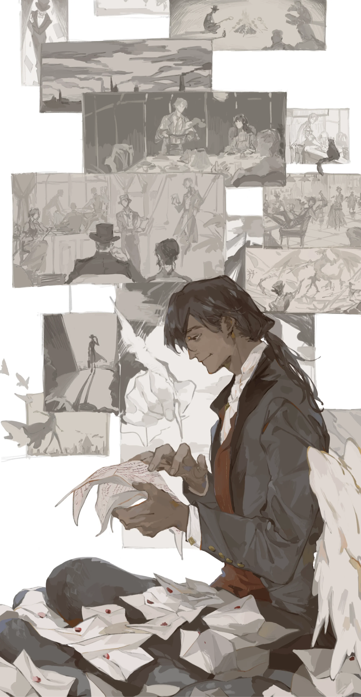
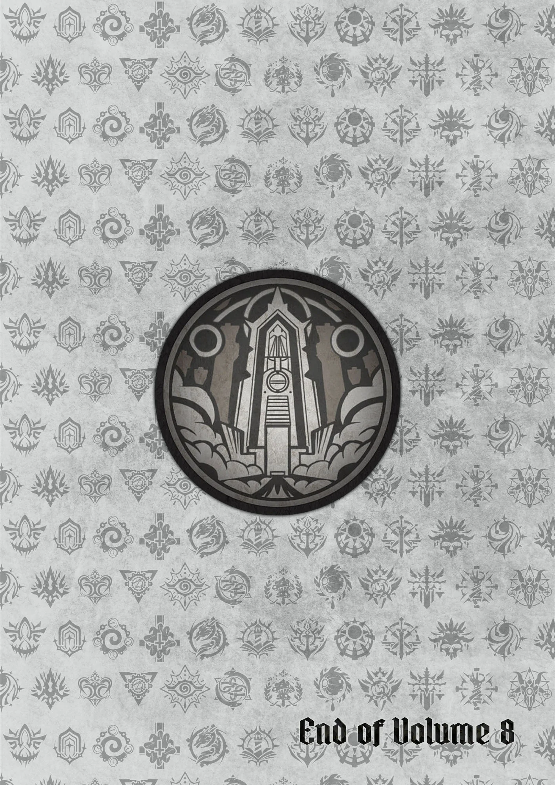
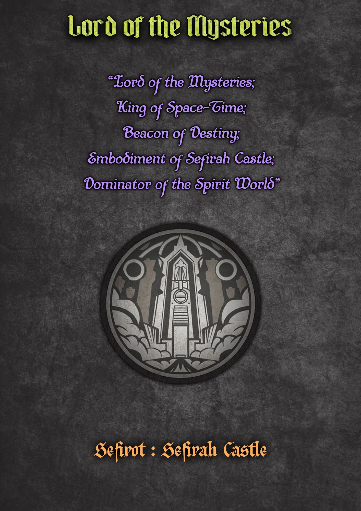
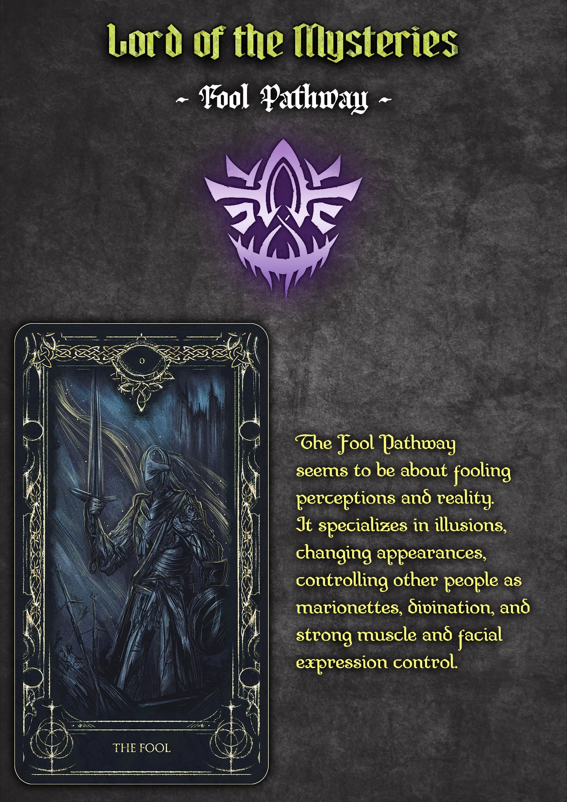
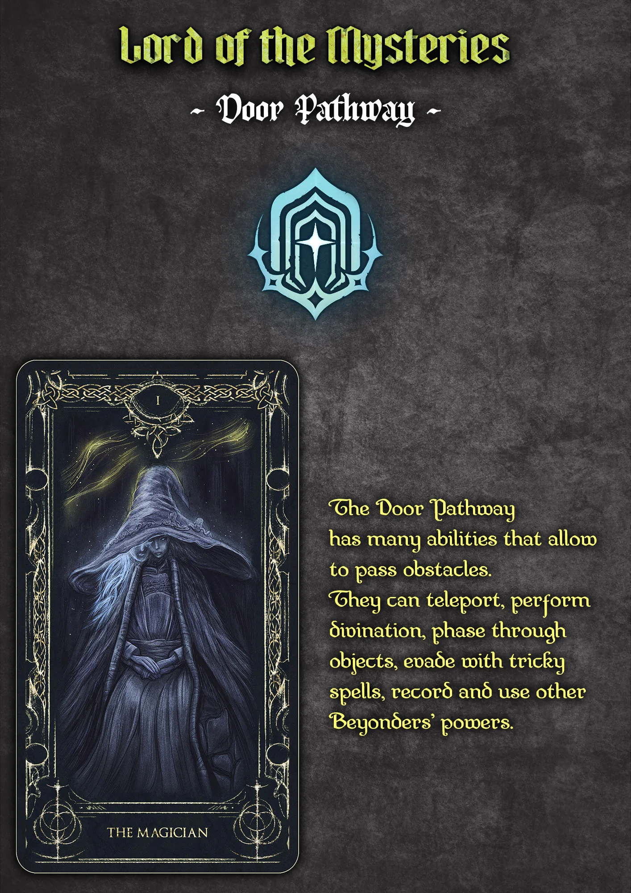
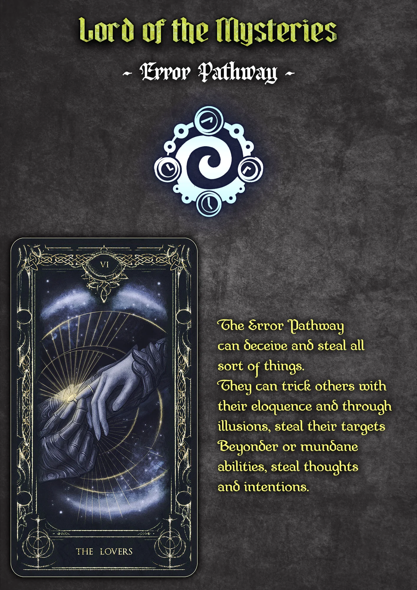
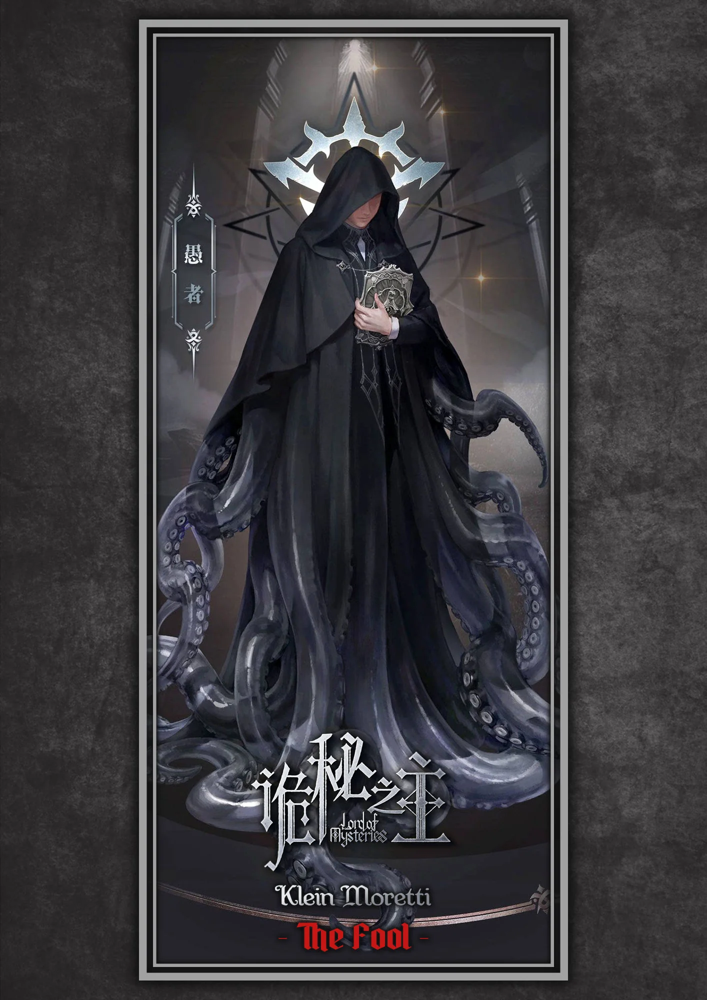
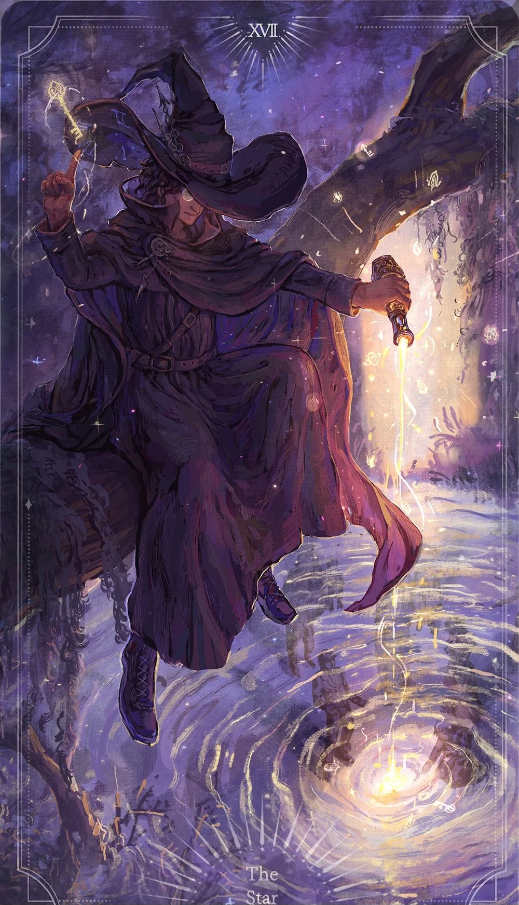
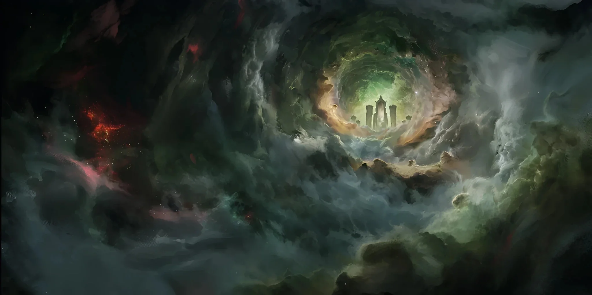
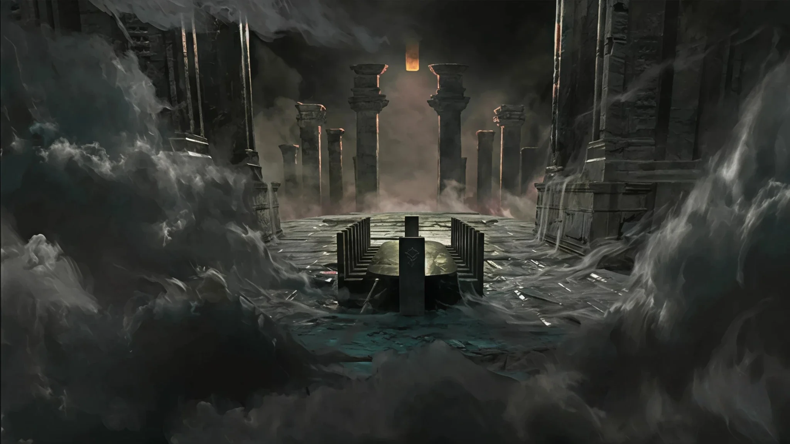

## Chapter 1394: A New Journey

In a room of an abandoned castle, sunlight shone through the gaps in the
thick curtains, illuminating a pitch-black coffin.

Suddenly, the lid of the coffin creaked and slowly moved to the side.

With a thud, it fell to the ground.

A few seconds later, Azik Eggers sat up, looking rather lost.

At that moment, he was wearing loose pajamas that had been popular in
Loen years ago. He resembled a noble who had woken up in his manor.

After a while, Azik narrowed his eyes slightly. He looked around in
confusion as though he didn't know who he was.

He then saw the brilliant sunlight that penetrated through the cracks
and saw the dust dancing in the sunlight. He saw letters scattered on
the table, ground, and coffin lid around him.

They were like giant snowflakes that blanketed half the area.

Azik got out of the coffin. With a puzzled expression, he bent down to
pick up a letter and began reading.

As he read, the confusion on his face disappeared a little, as if he had
remembered many things from the past.

Azik immediately found a chair and sat down, allowing all the letters to
fly in front of him to stack up like a mountain.

He opened the letters one by one, reading them one after another. There
would be pauses in between as he fell deep in thought as if he was
seriously recalling something.

The sunlight that passed through the gap in the curtains gradually
dimmed. After a long time, it shone inside again.

At that moment, Azik finally finished reading all the letters and
completed the long contemplations that resembled Cogitation.

"He" looked at the letters that had been stacked on the table and slowly
let out a long sigh.

Following that, he took out a piece of paper, a fountain pen, and some
ink that he could still use. He wrote with a warm expression:

"...I've already woken up and received all your letters. They made me
recall who I am and who you are. I also remember many memories of the
past.

"Your experiences, no matter how complicated and exciting, have exceeded
my imagination. It also makes me understand some of the problems that
previously plagued me.

"I can feel your joy, your exhaustion, your faith in life, and the heavy
responsibility that you have borne from your letters.

"I can roughly guess why you ultimately made that choice. If it were me,
I might not even be able to make such a decision.

"From the beginning, you've been a guardian. You mimicked others until
you were mimicked by others.

"Next, I will begin a journey to pursue the past and witness the changes
in this world.

"You seem to still be asleep, but it doesn't matter. I'll write to tell
you about the interesting things that I've encountered, the interesting
traditions, and interesting people.

"I think I should be able to send these letters to you via sacrifice..."

The tip of the golden pen reflected the sunlight as it rustled on the
white piece of paper, continuously penning down more content.

___

Backlund, in a solarium of a terrace house.

Melissa walked in with a girl who was clearly less than ten years old.

"Aunt Melissa, why here?" the little girl asked, puzzled. "All the
stories I heard had mysterious rituals held in the basement."

With her hair tied up, the bespectacled Melissa smiled and said, "Those
are unconventional mysticism rituals."

She pointed at the altar that had been set up and the unlit candles and
said, "You may begin."

"Really?" The little girl tilted her head to look at the bright sunshine
outside the window. "Do we need to draw the curtains?"

"There's no need. It's pretty good this way." After Melissa answered,
she smiled at the little girl while she awkwardly mimicked her usual
method of holding rituals in a clumsy and unfamiliar manner.

During this process, she would instruct her from time to time and even
personally help her to complete the pre-ritual preparations.

"Alright, repeat after me." Melissa took a deep breath as her expression
gradually turned staid.

"Yes, yes." The little girl tried her best to appear stern.

Melissa looked at the candle flames on the altar for a few seconds
before slowly reciting in ancient Hermes, "The Fool that doesn't belong
to this era..."

"Da Pool that dun pelong to diz ela..." The little girl had never
learned ancient Hermes before. Although she tried her best to imitate
her aunt, she still didn't know what she was saying.

"The mysterious ruler above the gray fog..." Melissa continued reciting.

"Da Mesterwes luler apove the gway pog..." the little girl recited in
all seriousness.

"The King of Yellow and Black who wields good luck..." After Melissa
finished reciting, the candle at the end didn't wait for the little girl
to imitate her. It immediately burgeoned to the size of a human head.

In the large flame, a slippery tentacle with a somewhat sinister pattern
extended out in an indiscernible manner. It was extremely slow.

The little girl was stunned. She retreated and hid behind her aunt.

Melissa pursed her lips and said with a gentle smile, "Don't be afraid,
go greet him."

The little girl timidly poked her head out from behind her aunt and saw
the terrifying, slimy tentacle gently swaying in the brilliant sunlight
that shone through the windows. It seemed to be attempting to swat away
the dust or was waving at her.

"Go, don't be afraid," Melissa repeated.

The little girl finally mustered her courage and stood in front of the
altar.

She recited the incantations she had just invented before revealing a
sincere smile and raised her palm.

The slippery tentacle whose patterns had disappeared paused for a few
seconds. It seemed hesitant and somewhat out of practice.

Then, it raised its head and curled up slightly, lowering itself inch by
inch.

Amidst the sunlight, it high-fived that tiny palm.

---THE END---

___

## Pathways Guide {epub:type=glossary .epub-invis}

## Image Gallery  {epub:type=glossary .epub-invis}

### Characters 

### Artworks

### Locations 

